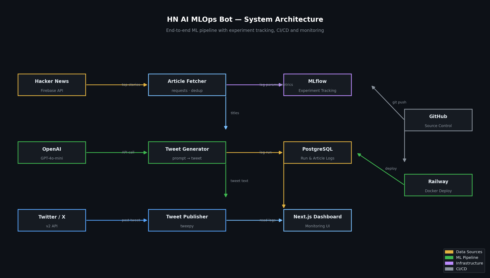
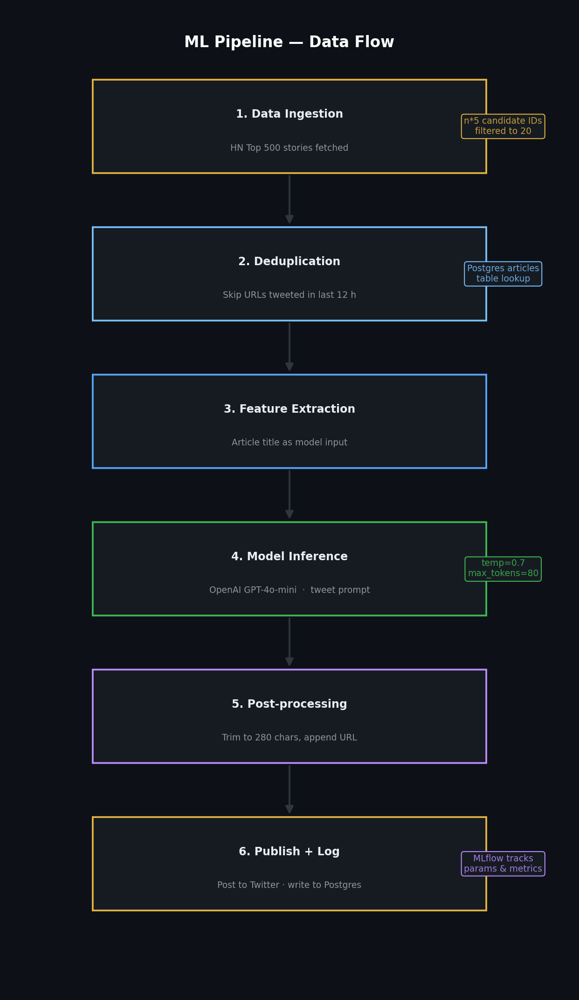
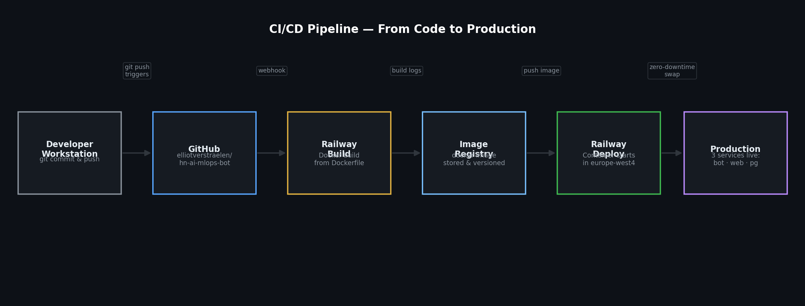
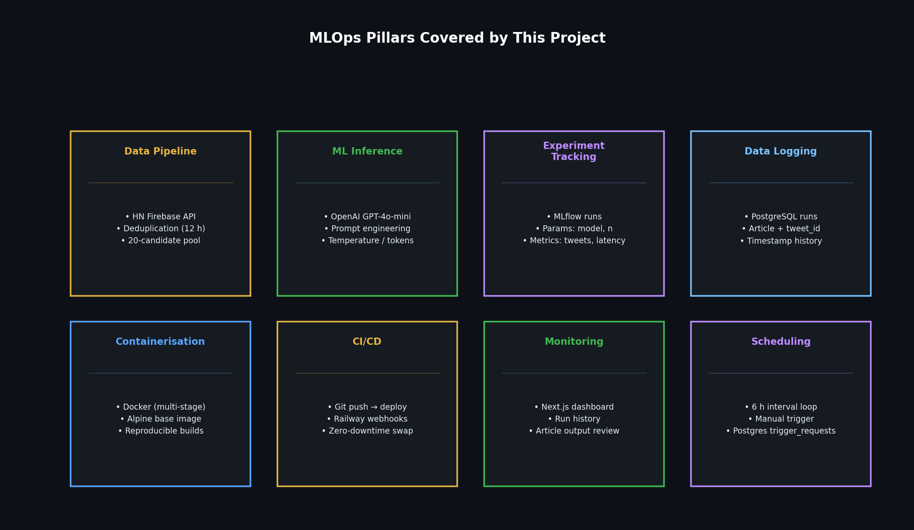

# HN AI MLOps Bot

Automated Twitter/X bot that fetches top Hacker News articles, generates developer-audience tweets with GPT-4o-mini, and tracks every run as an MLflow experiment. Built as an end-to-end MLOps project.

**Live dashboard:** https://web-production-63167.up.railway.app

---

## What it does

Every 6 hours the bot:
1. Fetches the top 500 HN stories, filters to 20 unseen candidates
2. Skips any URL already tweeted in the last 12 hours (Postgres dedup)
3. Calls GPT-4o-mini to write a punchy developer tweet per article
4. Rates each tweet 1–10 (also GPT-4o-mini) and logs the score
5. Posts up to 5 tweets via the Twitter v2 API
6. Logs params, metrics and cost to MLflow + Postgres

---

## Architecture



| Component | Role |
|---|---|
| **HN Firebase API** | Data source — top stories list |
| **OpenAI GPT-4o-mini** | Tweet generation + quality scoring |
| **Twitter v2 API (tweepy)** | Publishing |
| **MLflow** | Experiment tracking — params, metrics, run history |
| **PostgreSQL** | Persistent log of runs and articles |
| **Next.js dashboard** | Monitoring UI — run history, tweet output, quality scores |
| **Docker** | Containerisation (multi-stage Alpine build) |
| **Railway** | Cloud deployment, auto-deploy on git push |

---

## ML Pipeline



**6 steps per run:**

1. **Data Ingestion** — fetch top 500 HN story IDs, pull item metadata for the first 100
2. **Deduplication** — query Postgres for URLs tweeted in the last 12 h; skip them
3. **Feature Extraction** — the article title is the model input (no scraping needed)
4. **Model Inference** — GPT-4o-mini with a developer-audience system prompt (`temp=0.7`, `max_tokens=80`)
5. **Post-processing** — trim to 275 chars, append `\n{url}`
6. **Publish + Log** — post tweet, rate it 1–10, write to Postgres, log metrics to MLflow

---

## CI/CD Pipeline



`git push origin main` → GitHub webhook → Railway builds Docker image → zero-downtime container swap in `europe-west4`.

Tests run automatically on every push via GitHub Actions (`.github/workflows/test.yml`).

---

## MLOps Pillars



| Pillar | Implementation |
|---|---|
| **Data Pipeline** | HN Firebase API → dedup → 20-candidate pool |
| **ML Inference** | OpenAI GPT-4o-mini, configurable prompt |
| **Experiment Tracking** | MLflow — model, n_articles, tokens, cost, quality score |
| **Data Logging** | PostgreSQL `runs` + `articles` tables, 12 h rolling dedup |
| **Containerisation** | Multi-stage Dockerfile, `node:20-alpine` / `python:3.11-slim` |
| **CI/CD** | GitHub Actions (pytest) + Railway auto-deploy on push |
| **Monitoring** | Next.js dashboard — run history, tweet cards, quality badges |
| **Scheduling** | 6 h interval loop + manual trigger via dashboard |

---

## Metrics tracked per run (MLflow)

| Metric | Description |
|---|---|
| `articles_fetched` | Candidates after dedup |
| `tweets_posted` | Successfully published tweets |
| `avg_inference_seconds` | Mean GPT latency per tweet |
| `total_inference_seconds` | Total GPT time for the run |
| `total_prompt_tokens` | Input tokens consumed |
| `total_completion_tokens` | Output tokens generated |
| `total_cost_usd` | API cost at GPT-4o-mini rates ($0.15/1M in, $0.60/1M out) |
| `avg_quality_score` | Mean self-evaluated tweet quality (1–10) |

---

## Project structure

```
.
├── bot/
│   ├── main.py              # Pipeline logic
│   ├── requirements.txt
│   └── tests/
│       └── test_bot.py      # Unit tests (9 tests)
├── web/
│   ├── src/app/             # Next.js 16 pages + API routes
│   ├── src/lib/db.ts        # Postgres query helpers
│   └── Dockerfile
├── diagrams/                # PNG diagrams for presentation
├── Dockerfile               # Bot container
├── .github/workflows/
│   └── test.yml             # CI — pytest on every push
└── docker-compose.yml       # Local dev
```

---

## Environment variables

| Variable | Service | Description |
|---|---|---|
| `OPENAI_API_KEY` | bot | GPT-4o-mini inference + scoring |
| `HF_API_TOKEN` | *(removed)* | Was used for BART; replaced by OpenAI |
| `TWITTER_*` (5 vars) | bot | Twitter v2 API credentials |
| `DATABASE_URL` | bot + web | Postgres connection string |
| `MLFLOW_TRACKING_URI` | bot | MLflow tracking server (default: `/app/mlruns`) |

---

## Running locally

```bash
cp .env.example .env   # fill in credentials
docker compose up
```

Dashboard runs at `http://localhost:3000`.
